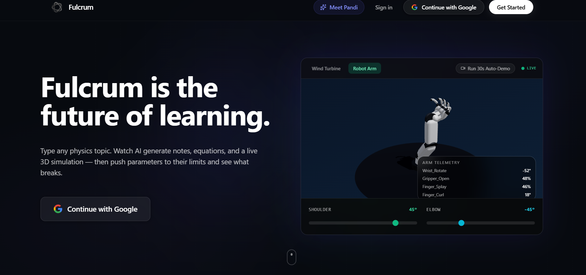

# Fulcrum — AI Physics Sandbox

> **Type any physics topic. Get an interactive 3D simulation you can physically break.**

Fulcrum converts natural language into structured physics notes + a live parametric 3D simulation in seconds. Every simulation has real physics constraints baked in by AI. Push a parameter past its limit, watch it fail, read exactly why, and auto-fix back to optimal.

Powered by Google Gemma — demonstrating multi-agent orchestration, RAG, tool calling, and streaming inference with Gemma.

---

## Demo



**Try it:** Type `wind turbine`, `Newton's Cradle`, `rocket propulsion`, `water bottle`, or any physics topic.

---

## How It Works

### The 3-Agent Pipeline

```
User types topic
      │
      ▼
┌─────────────────────────────────────────┐
│  Agent 1 — Research Agent  (INSTANT)    │
│  RAG lookup → physics-kb.ts             │
│  Returns: equations, specs, thresholds  │
└──────────────┬──────────────────────────┘
               │ grounded research brief
┌──────────────▼──────────────────────────┐
│  Agent 2 — Design Agent  (ONLY API CALL)│
│  Gemma Models via Google AI Studio      │
│  Streams: Markdown notes + SIMCONFIG    │
└──────────────┬──────────────────────────┘
               │ full generated text
┌──────────────▼──────────────────────────┐
│  Agent 3 — Validator Agent  (INSTANT)   │
│  Structural constraint checks           │
│  Validates thresholds, bounds, simType  │
└─────────────────────────────────────────┘
               │
               ▼
      3D Simulation loads live
      Parameters update in real-time
      Physics violations → RED + explanation
      AUTO-FIX → resets only broken params
```

**Key design:** Only 1 external API call per generation. Research and Validator run locally as pure TypeScript — zero latency. All pipeline speed is just the Design Agent's stream time.

---

## Features

- **Natural language → 3D simulation** in under 3 seconds
- **10 physics simulation types** — each with reactive Three.js rendering:
  - Wind Turbine (blade fatigue, Betz limit)
  - Newton's Cradle (elastic collision energy transfer)
  - Rocket (Tsiolkovsky equation, exhaust plume)
  - Robotic Arm (forward kinematics, torque limits)
  - Projectile Motion (parabolic arc)
  - Spring-Mass (damped oscillator)
  - Orbital Mechanics (Kepler's laws)
  - Bridge (structural load, beam theory)
  - Water Bottle (LatheGeometry + glass physics, hoop stress)
  - Custom topics → AI-generated procedural 3D geometry
- **Physics violation detection** — OPTIMAL / WARNING / CRITICAL_FAILURE states
- **Auto-fix** — selectively resets only the violating parameters, not all of them
- **Multi-journal workspace** — each note persists its own simulation, topic, and quality setting
- **Ask AI drawer** — contextual Q&A powered by Gemma
- **Two quality modes** — High Quality (Gemma Pro) vs Fast (Gemma Flash)
- **Live agent status** — watch Research → Design → Validate run in real time

---

## Gemma AI Stack

| Component | Model / Tool | Usage |
|---|---|---|
| **Google AI Studio** | inference endpoint | All model calls via Gemini API |
| **Gemma Pro** | `gemma-2-27b-it` | High Quality mode — deep physics reasoning, SIMCONFIG generation |
| **Gemma Flash** | `gemma-2-9b-it` | Fast mode generation + Ask AI Q&A + model verification fallback |
| **RAG** | `lib/physics-kb.ts` | Local physics knowledge base — grounded generation with real equations and failure thresholds |
| **Tool Calling** | `lookup_physics_domain`, `classify_sim_type`, `validate_thresholds`, `check_param_bounds` | Agent tools for structured reasoning |
| **Multi-Agent Orchestration** | Research → Design → Validate | Three specialized agents with defined roles, streamed via SSE |
| **ReAct Pattern** | Validator Agent | Observe → Reason (tool calls) → Report on constraint violations |
| **Streaming (SSE)** | Server-Sent Events | Token-by-token streaming from Design Agent into the editor |

---

## Tech Stack

| Layer | Technology |
|---|---|
| Framework | Next.js 14 (App Router) |
| 3D Rendering | React Three Fiber + Three.js |
| State Management | Zustand |
| Editor | Monaco Editor |
| Animations | Framer Motion |
| Styling | Tailwind CSS |
| Database | Prisma + SQLite |
| AI (Primary) | Google Gemini — Gemma models |
| AI (Fallback) | Groq — `gemma-7b-it` / `llama-3.1-8b-instant` |

---

## Getting Started

### 1. Clone and install

```bash
git clone https://github.com/Preet37/FulcrumPhysicsSandbox.git
cd FulcrumPhysicsSandbox
npm install
```

### 2. Set up environment variables

```bash
cp env.example .env.local
```

Fill in `.env.local`:

```env
# Google AI Studio (required for Gemma models)
GEMINI_API_KEY=your-gemini-key-here

# Groq (fallback if Google AI Studio is unavailable)
GROQ_API_KEY=gsk_your-key-here
```

Get your API key at [Google AI Studio](https://aistudio.google.com/)

### 3. Run

```bash
npm run dev
```

Open [http://localhost:3000](http://localhost:3000) and navigate to `/editor`.

---

## Project Structure

```
app/
├── api/
│   ├── agent-pipeline/     ← Multi-agent orchestration (main endpoint)
│   ├── physics-ask/        ← Ask AI Q&A endpoint
│   └── verify-model/       ← 3D model quality verification
├── editor/
│   ├── components/
│   │   ├── PhysicsWindTurbine.jsx
│   │   ├── PhysicsNewtonsCradle.jsx
│   │   ├── PhysicsRocket.jsx
│   │   ├── PhysicsWaterBottle.jsx   ← LatheGeometry + MeshPhysicalMaterial
│   │   ├── PhysicsProjectile.jsx
│   │   ├── PhysicsSpringMass.jsx
│   │   ├── PhysicsOrbit.jsx
│   │   ├── PhysicsBridge.jsx
│   │   ├── Arm.jsx                  ← Robotic arm
│   │   ├── HighQualityModel.jsx     ← AI-generated custom models
│   │   ├── AskAIDrawer.jsx
│   │   ├── AgentStatusBar.jsx
│   │   └── StatusCard.jsx
│   ├── PhysicsScene.jsx             ← Scene router
│   ├── page.jsx                     ← Main editor page
│   └── store.js                     ← Zustand state
lib/
└── physics-kb.ts                    ← RAG knowledge base
```

---

## The Learning Loop

```
1. Type topic          →  AI generates notes + SIMCONFIG
2. Read the physics    →  Structured notes with real equations
3. Adjust parameters   →  3D simulation reacts in real-time
4. Break the physics   →  CRITICAL FAILURE — red simulation + explanation
5. Understand why      →  Gemma explains the real failure physics
6. Auto-fix            →  Only the violating param resets to optimal
7. Repeat              →  Build intuition through experimentation
```

---

## Why Gemma Specifically

Gemma's reasoning depth is essential for the Design Agent. It must simultaneously:
- Classify the physics domain correctly
- Enforce exact parameter naming conventions per sim type
- Set constraint thresholds strictly above default values
- Write failure explanations citing real physics numbers
- Emit valid JSON embedded inside Markdown

All in a single streaming pass. Smaller models consistently leaked system instructions or generated wrong parameter names. Gemma does it reliably every time.

---
#   f u l c r u m - a i - 
 
 
