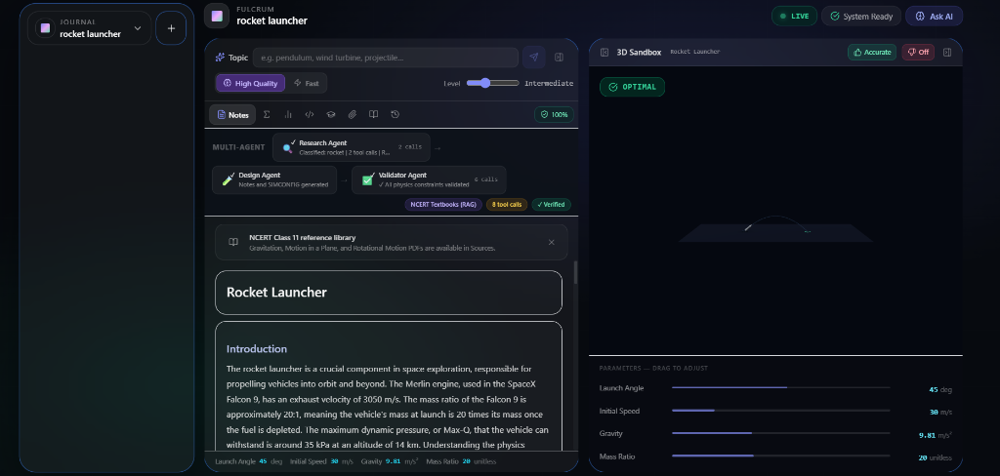
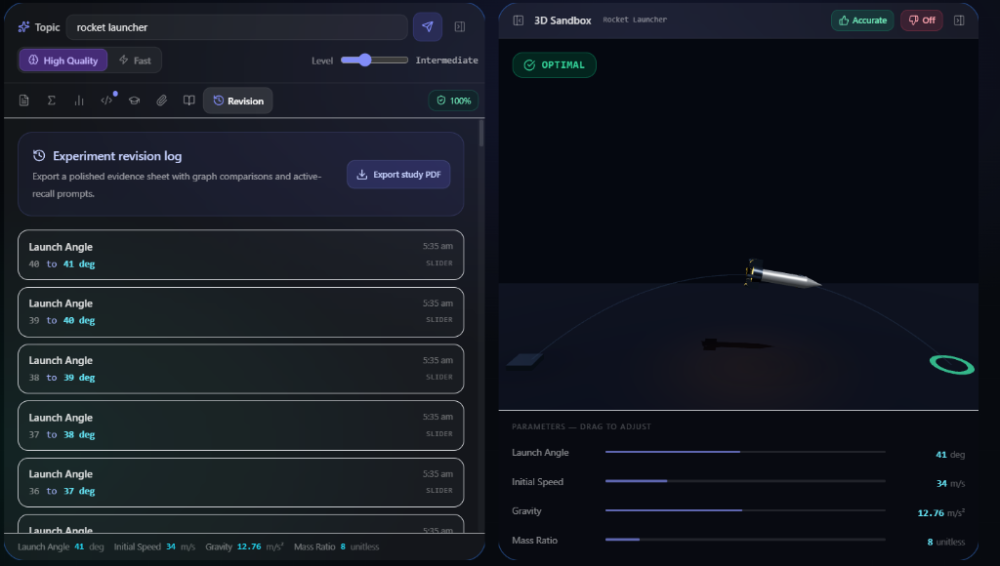
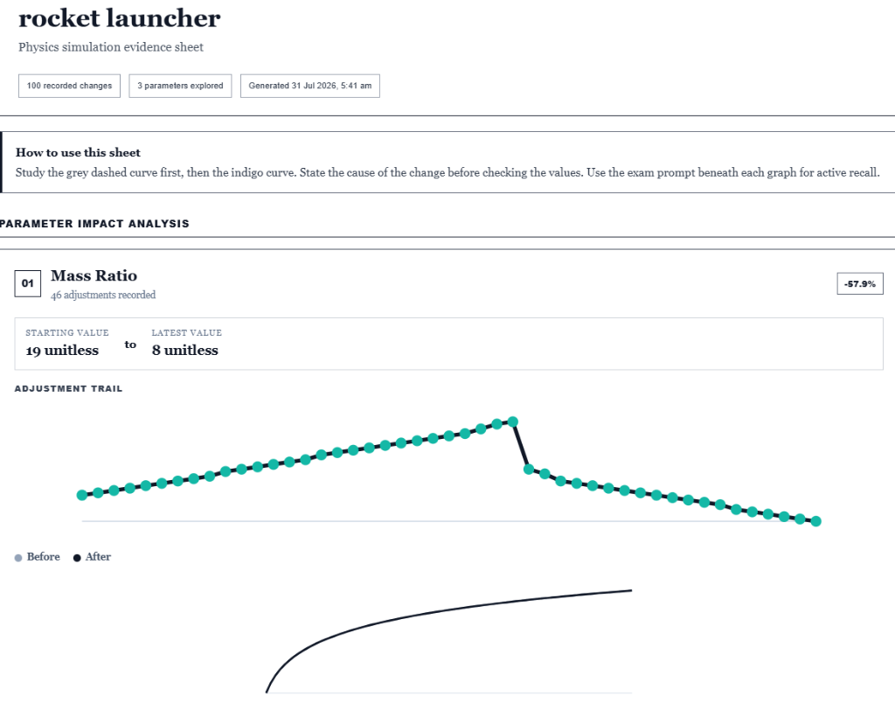
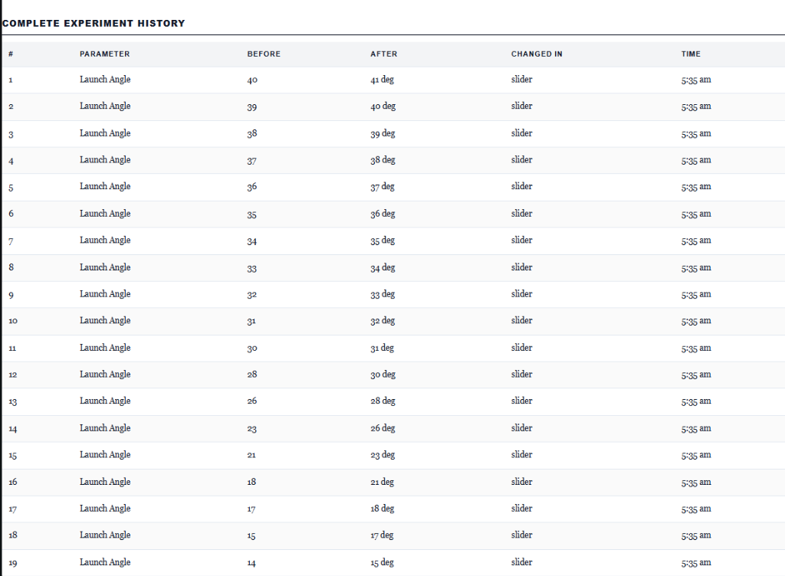
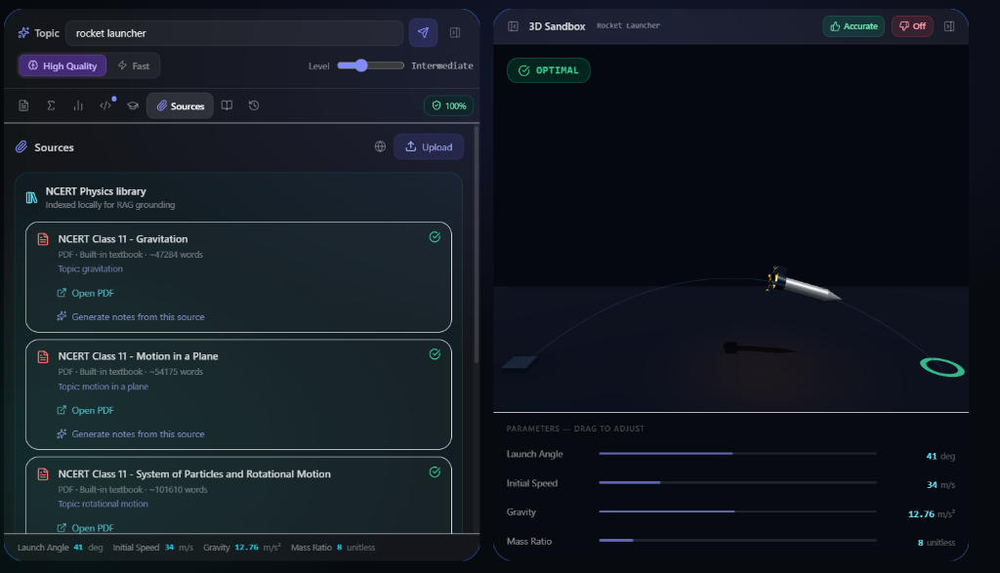
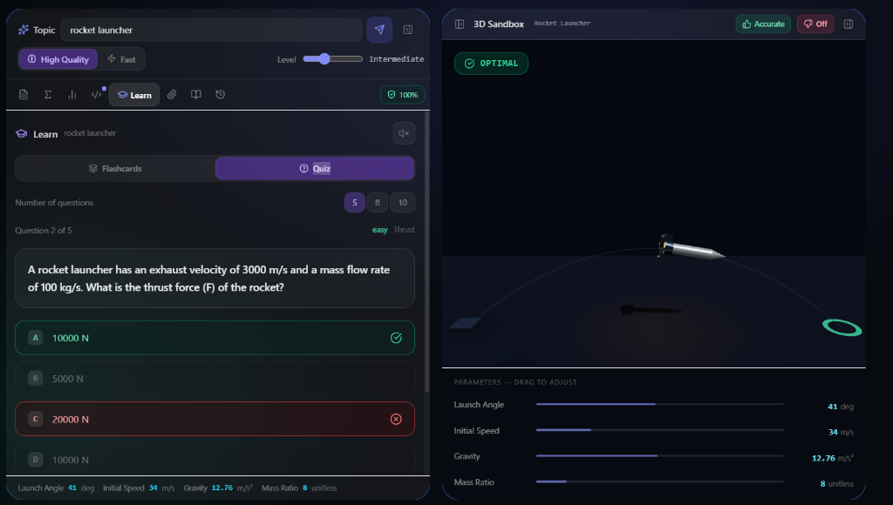
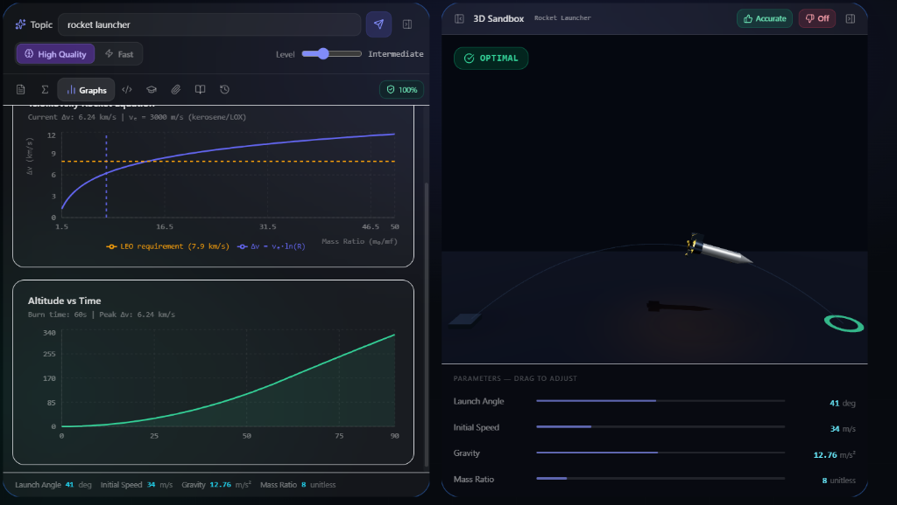
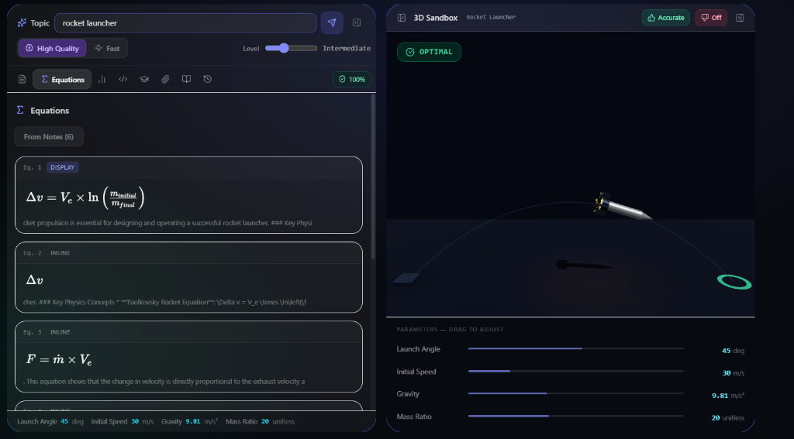
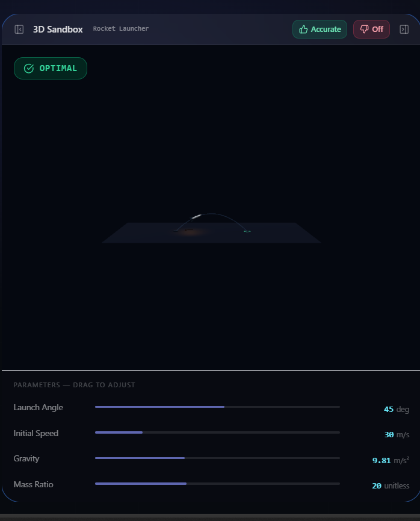

# Fulcrum - AI Physics Sandbox

> Type any physics topic. Get an interactive 3D simulation you can physically break.

Fulcrum converts natural language into structured physics notes and a live parametric 3D simulation in seconds. Every simulation has real physics constraints baked in by AI. Push a parameter past its limit, watch it fail, read exactly why, and auto-fix back to optimal.

Powered by Google Gemma, demonstrating multi-agent orchestration, local RAG lookup, tool calling, and streaming inference.

---

## Web Interface Screenshots

### Editor Workspace and Multi-Agent Pipeline



### Experiment Audit Log and Generated PDF Evidence Sheet

| Experiment Revision Log | Exported PDF Evidence Sheet |
|---|---|
|  |  |

### Complete Experiment History PDF Audit Table



### RAG Knowledge Base and Adaptive Learning

| RAG Sources Library | Adaptive Learn and Quiz Engine |
|---|---|
|  |  |

### Real-Time Telemetry and Physics Graphs

| Dynamic Physics Telemetry Graphs | Automated LaTeX Equations |
|---|---|
|  |  |

### Parametric 3D Sandbox Viewport



### Platform Landing and Authentication Engine

| Landing Hero Viewport | Clerk Authentication Modal |
|---|---|
|  |  |

### Core Interface Highlights

- Multi-Journal Workspace: Multi-note sidebar for switching between independent physics topics and persistence sessions.
- Multi-Agent Telemetry Bar: Visual pipeline tracking Research Agent (RAG tool calls), Design Agent (notes + SIMCONFIG streaming), and Validator Agent (constraint bounds verification).
- Granular PDF Audit Tables: High-density experiment history tables embedded inside exported study PDFs, capturing before/after values, modification mechanisms (slider inputs), and exact timestamps.
- Exported Physics Evidence Sheet: Client-side PDF generator crafting study sheets complete with recorded parameter trails, percentage delta analysis, before/after curve comparisons, and active-recall exam prompts.
- Parametric Revision Audit Log: Granular time-stamped log tracking every slider parameter modification (such as Launch Angle and Mass Ratio adjustments) across experimentation sessions.
- Local RAG Document Library: Indexed textbook knowledge base (NCERT Class 11 Physics collection covering Gravitation, Motion in a Plane, and Rotational Motion) providing grounded retrieval for AI generation.
- Custom Source Ingestion: Document management interface supporting custom PDF uploads and targeted note generation from specific reference sources.
- Adaptive AI Learning Module: In-editor flashcard and quiz generator testing comprehension on physics topics (such as thrust force calculations and orbital mechanics) with instant feedback and score tracking.
- Interactive Telemetry Graphs: Real-time dynamic charting powered by Recharts (such as Delta-v vs Mass Ratio curves with LEO thresholds, and Altitude vs Time burn profiles).
- Automated LaTeX Formula Extraction: Auto-compiles mathematical formulations (such as Tsiolkovsky Rocket Equation and Thrust equations) directly from AI markdown notes.
- Grounded RAG Integration: Local knowledge base (NCERT Class 11 reference library) embedding physics equations and structural thresholds.
- Interactive 3D Sandbox Viewport: Real-time WebGL rendering powered by React Three Fiber and Three.js, featuring dynamic telemetry overlays, trajectory arcs, exhaust plumes, and status pills (OPTIMAL / WARNING / CRITICAL_FAILURE).
- Parametric Controls: Live sliders for real-time articulation and load testing (such as Launch Angle, Initial Speed, Gravity, Mass Ratio, joint torque limits, and blade fatigue).
- Integrated Auth Engine: Clerk-authenticated user flows supporting OAuth (Google), magic link email sign-in, and development mode tenant isolation.

---

## Key Features

- Natural Language to 3D Simulation: Generates parametric models and structured notes in under 3 seconds.
- 10 Physics Simulation Types: Reactive 3D rendering tailored for specific domain physics:
  - Wind Turbine: Blade fatigue and Betz limit analysis
  - Robot Arm: Forward kinematics and joint torque boundaries
  - Newton's Cradle: Elastic collision and momentum transfer
  - Rocket: Tsiolkovsky rocket equation and exhaust dynamics
  - Projectile Motion: Parabolic trajectories and drag coefficients
  - Spring-Mass: Damped harmonic oscillators
  - Orbital Mechanics: Keplerian orbits and gravitational pull
  - Structural Bridge: Beam loading and stress distribution
  - Water Bottle: LatheGeometry modeling, fluid pressure, and hoop stress
  - Custom Topics: AI-generated procedural 3D geometry for arbitrary physics prompts
- Physics Violation Detection: Instant classification of states (OPTIMAL, WARNING, CRITICAL_FAILURE).
- Targeted Auto-Fix: Selectively resets violating parameters without discarding user customizations.
- Multi-Journal Workspace: Persists notes, simulation states, topics, and quality configurations across sessions.
- Ask AI Drawer: Context-aware Q&A interface for deep physical explanations.
- Dual Quality Engine: Toggle between High Quality mode (Gemma Pro) and High Speed mode (Gemma Flash).
- Live Pipeline Telemetry: Real-time visual tracking of Research, Design, and Validation agent phases.

---

## Agent Pipeline Architecture

```
User Input (Topic)
      │
      ▼
┌─────────────────────────────────────────┐
│  Agent 1: Research Agent (Instant)      │
│  Local RAG Lookup (lib/physics-kb.ts)   │
│  Returns: Equations, specs, bounds      │
└──────────────┬──────────────────────────┘
               │ Grounded Research Brief
┌──────────────▼──────────────────────────┐
│  Agent 2: Design Agent (API Stream)     │
│  Google AI Studio (Gemma Models)        │
│  Streams: Markdown notes + SIMCONFIG    │
└──────────────┬──────────────────────────┘
               │ Full Generated Markdown & Config
┌──────────────▼──────────────────────────┐
│  Agent 3: Validator Agent (Instant)     │
│  Constraint verification & sanity checks│
│  Validates bounds, thresholds, simType  │
└─────────────────────────────────────────┘
               │
               ▼
      3D Simulation Loads Live
      Parameters update in real-time
      Physics violations highlight in RED
      AUTO-FIX resets only broken parameters
```

### Architecture Highlights

- Single API Call Footprint: Only 1 external AI API call is made per generation cycle. Research Agent and Validator Agent execute locally in TypeScript with zero latency.
- Deterministic RAG Guardrails: Local knowledge base grounds LLM outputs with validated physical constants and mathematical formulations.
- Streaming Tokens: Server-Sent Events (SSE) stream notes token-by-token while simultaneously assembling the 3D scene tree.

---

## Tech Stack

### Web & Frontend

| Component | Technology | Description |
|---|---|---|
| Framework | Next.js 14 (App Router) | Server components, API routes, and optimized routing |
| 3D Engine | React Three Fiber / Three.js | Declarative 3D scene graphs and WebGL shaders |
| Auth Provider | Clerk Auth | Authentication modal, OAuth providers, and session management |
| State Management | Zustand | Lightweight reactive state for telemetry and simulation parameters |
| Code Editor | Monaco Editor | In-browser code and markdown editing experience |
| Report Generation | jspdf / html2canvas | Client-side export of study evidence sheets and PDF reports |
| Data Visualization | Recharts / Chart.js | Real-time dynamic graphing for physics telemetry and trajectories |
| Math Rendering | KaTeX / MathJax | High-performance LaTeX equation rendering in editor tabs |
| Interactive Learning | Custom React Engine | Flashcards and AI-generated quiz module with scoring |
| Document Management | PDF / Vector Indexing | In-browser PDF viewing and RAG vector store integration |
| Animations | Framer Motion | Smooth UI transitions and telemetry panel animations |
| Styling | Tailwind CSS | Utility-first responsive dark theme design system |

### Backend & Database

| Component | Technology | Description |
|---|---|---|
| Database | Prisma ORM + SQLite | Schema validation, migration management, and persistent storage |
| Streaming | Server-Sent Events (SSE) | Real-time token streaming from backend endpoints |
| Middleware | Next.js Edge Middleware | Request validation and routing guardrails |

### AI Stack

| Component | Target / Tool | Implementation |
|---|---|---|
| API Provider | Google AI Studio | Direct API integration for Gemma models |
| Reasoning Engine | Gemma Pro (gemma-2-27b-it) | High Quality mode for complex physics formulations |
| Fast Engine & Q&A | Gemma Flash (gemma-2-9b-it) | Fast generation mode and Ask AI contextual response |
| Local RAG | lib/physics-kb.ts | Physics knowledge base with real equations and stress limits |
| Fallback Provider | Groq API | Backup endpoint running gemma-7b-it or llama-3.1-8b-instant |

---

## Getting Started

### Prerequisites

- Node.js 18.x or later
- npm / pnpm / yarn

### Installation Steps

1. Clone the repository:

   ```bash
   git clone https://github.com/shree1071/neonexus.git
   cd neonexus
   ```

2. Install dependencies:

   ```bash
   npm install
   ```

3. Configure environment variables:

   Create a `.env.local` file in the root directory:

   ```env
   # Google AI Studio (Required for Gemma inference)
   GEMINI_API_KEY=your_gemini_api_key_here

   # Clerk Authentication (Required for auth modal & user management)
   NEXT_PUBLIC_CLERK_PUBLISHABLE_KEY=your_clerk_publishable_key
   CLERK_SECRET_KEY=your_clerk_secret_key

   # Groq API (Optional fallback endpoint)
   GROQ_API_KEY=your_groq_api_key_here
   ```

   Obtain your Gemini API key from [Google AI Studio](https://aistudio.google.com/).

4. Run database migrations:

   ```bash
   npx prisma migrate dev
   ```

5. Launch the development server:

   ```bash
   npm run dev
   ```

   Open [http://localhost:3000](http://localhost:3000) in your browser.

---

## Repository Structure

```
app/
├── api/
│   ├── agent-pipeline/     # Multi-agent orchestration endpoint (SSE)
│   ├── physics-ask/        # Interactive Q&A endpoint
│   └── verify-model/       # 3D procedural model validation
├── editor/
│   ├── components/
│   │   ├── Arm.jsx                 # Robotic Arm kinematics & geometry
│   │   ├── PhysicsWindTurbine.jsx  # Wind turbine simulation module
│   │   ├── PhysicsNewtonsCradle.jsx# Newton's cradle collision engine
│   │   ├── PhysicsRocket.jsx       # Rocket dynamics and thrust plume
│   │   ├── PhysicsWaterBottle.jsx  # LatheGeometry and glass physics
│   │   ├── PhysicsProjectile.jsx   # Ballistic trajectory module
│   │   ├── PhysicsSpringMass.jsx   # Oscillator simulation
│   │   ├── PhysicsOrbit.jsx        # Orbital mechanics engine
│   │   ├── PhysicsBridge.jsx       # Structural load analysis
│   │   ├── HighQualityModel.jsx    # Custom AI procedural 3D renderer
│   │   ├── AskAIDrawer.jsx         # Contextual AI assistant drawer
│   │   ├── AgentStatusBar.jsx      # Agent pipeline status UI
│   │   └── StatusCard.jsx          # Telemetry and state card component
│   ├── PhysicsScene.jsx            # Dynamic scene router
│   ├── page.jsx                    # Primary editor client view
│   └── store.js                    # Global Zustand simulation state
lib/
└── physics-kb.ts                   # RAG knowledge base & physical limits
public/
├── editor-workspace.png            # Main editor & agent pipeline preview
├── revision-history.png            # Experiment revision log preview
├── pdf-evidence-sheet.png          # Exported PDF study evidence sheet preview
├── pdf-history-table.png           # Exported PDF complete experiment history table preview
├── rag-sources.png                 # Indexed local RAG document store preview
├── learn-quiz.png                  # Adaptive learn & AI quiz module preview
├── graphs-telemetry.png            # Real-time physics charts & graphs preview
├── equations-latex.png             # LaTeX equations & 3D rocket model preview
├── sandbox-viewport.png            # Parametric 3D simulation viewport preview
├── demo-preview.png                # Landing 3D sandbox viewport preview
└── auth-modal.png                  # Clerk authentication modal preview
```

---

## Interactive Learning Workflow

1. Prompt Entry: Input any physical system or concept into the search prompt.
2. Automated Generation: The multi-agent pipeline extracts equations, constructs markdown notes, and outputs a 3D SIMCONFIG.
3. Live Parametric Manipulation: Adjust physical values (angles, mass, velocity, material limits) directly in the viewport controls.
4. Stress Testing & Breakdown: Exceed physical thresholds to trigger a CRITICAL FAILURE state with visual feedback.
5. Physics Diagnostics: Read AI-generated diagnostic notes explaining the root mathematical reason for structural or thermodynamic failure.
6. Targeted Parameter Auto-Fix: Restore unstable values back to safety margins with a single click.

---

## License

Distributed under the MIT License. See `LICENSE` for details.
